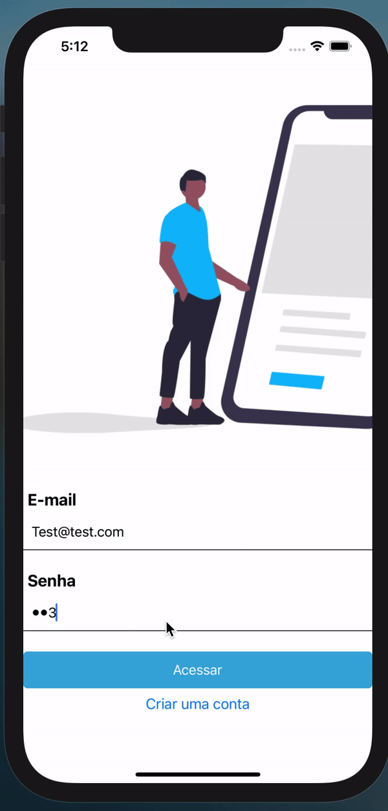

# loginFirebase
App de um sistema de cadastro funcional desenvolvido em React Native 

# O que e?
Aplicativo mobile desenvolvido em React Native com integração Firebase, projeto funcional de cadastro, login e home :busts_in_silhouette:

##:iphone: Tecnologias

<table>
<thead>
<th>React Native </th>
</thead>
<tr>
<td>Firebase</td>
</tr>
<tr>
<td>React Navigation</td>
</tr>
 <tr>
<td>React Hooks</td>
</tr>
</table>

#Desenvolvido por github.com/souzatotolo
